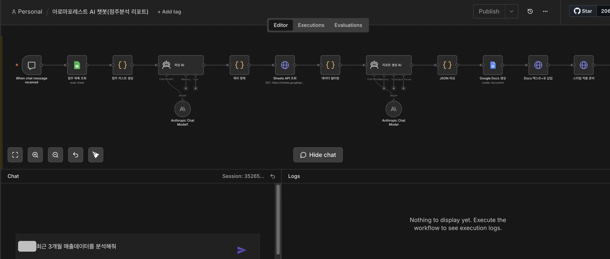
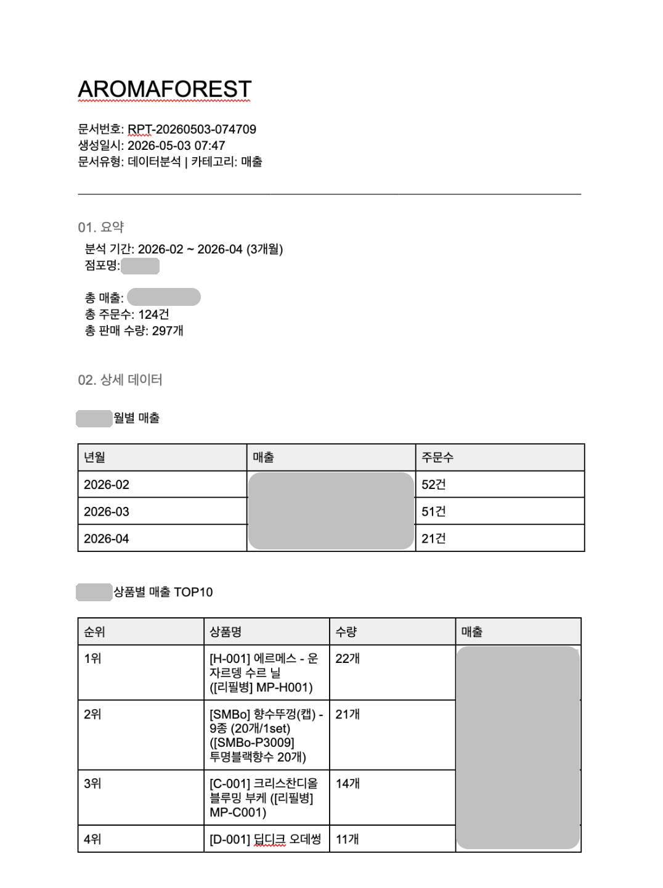
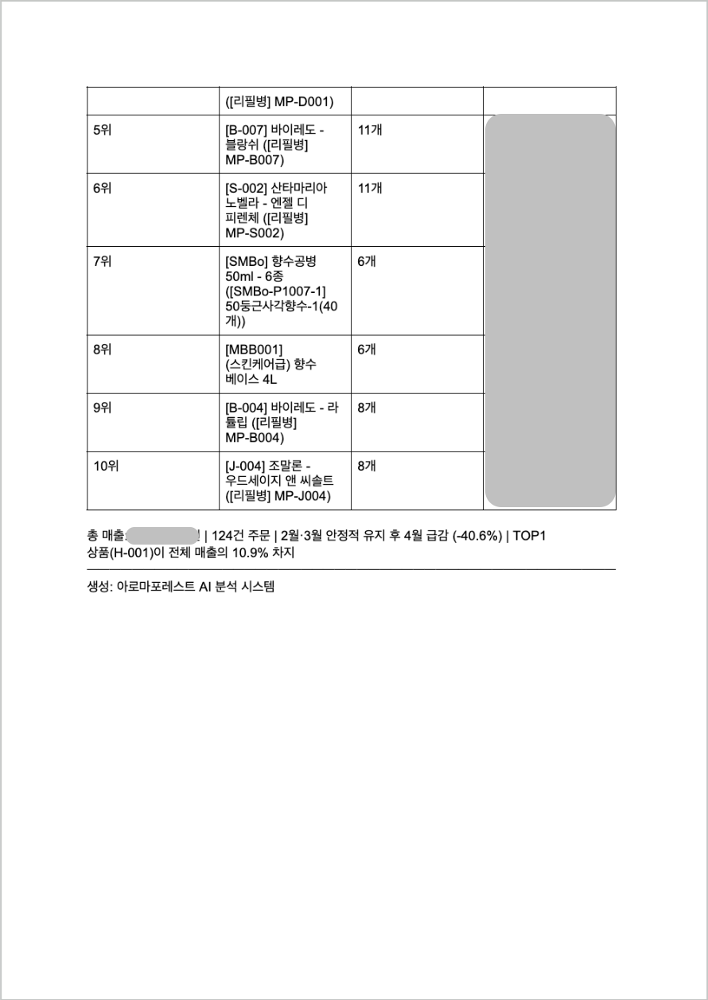
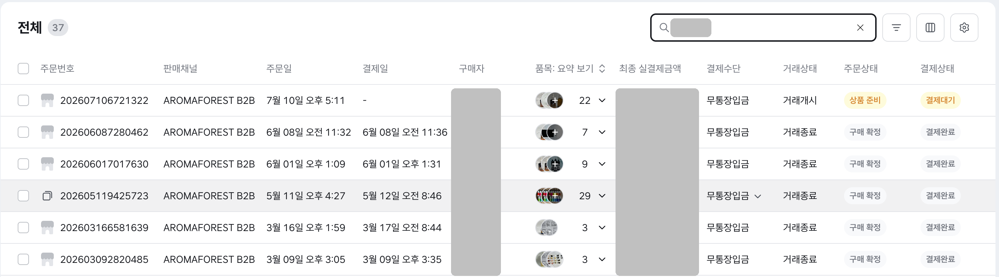
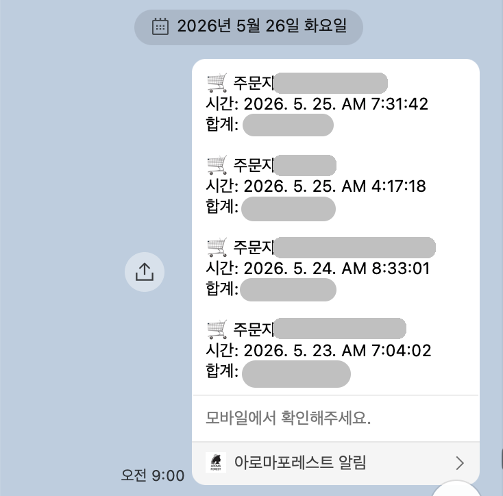
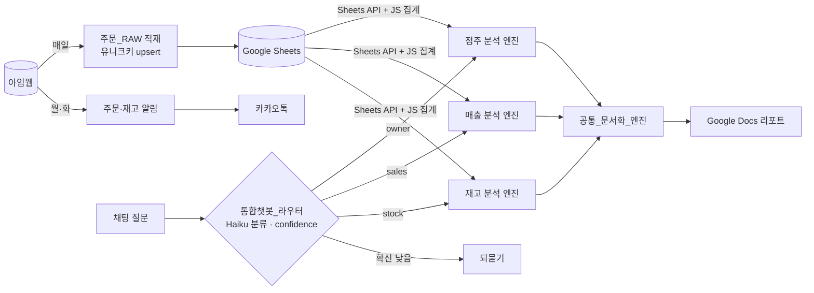
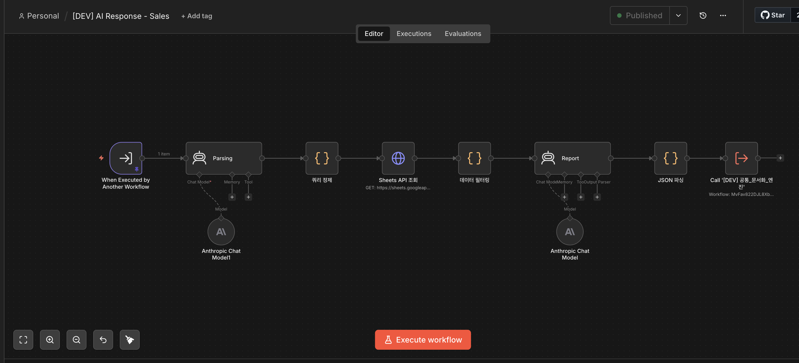
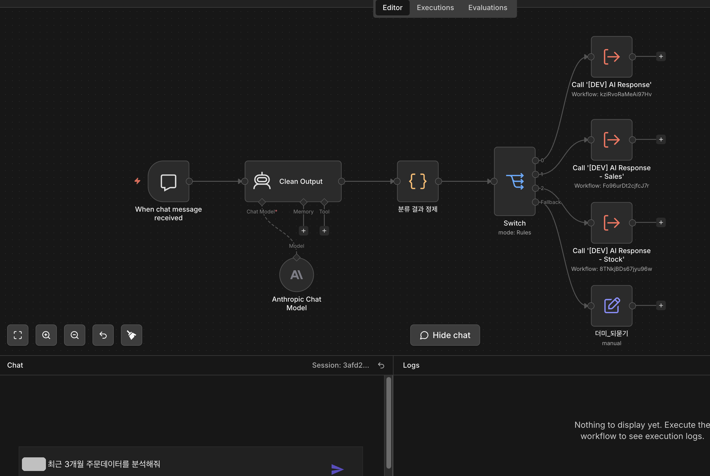
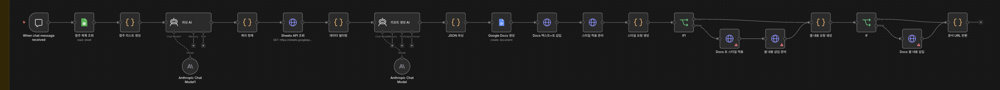
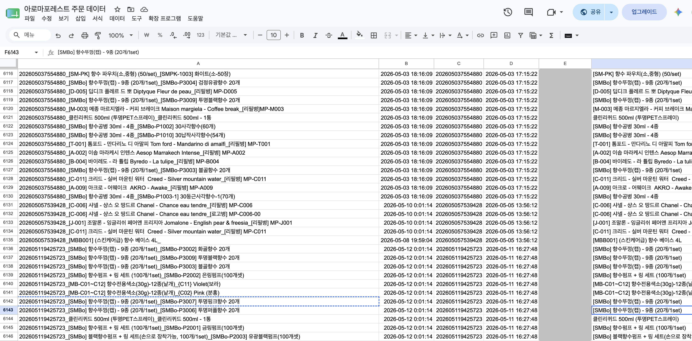

<p align="center"></p>

<h1 align="center">Aromaforest Workflow</h1>
<p align="center">향수 프랜차이즈 본사의 주문·재고·매출 업무를 자동화하고, 채팅으로 질문하면 분석 리포트를 만들어 주는 n8n 시스템<br><b>2026.04부터 실제 본사 운영에 쓰고 있습니다</b></p>

<p align="center">
<code>n8n (self-hosted)</code> <code>Oracle Cloud ARM</code> <code>Docker</code> <code>Caddy(HTTPS)</code> <code>아임웹 API</code> <code>Google Sheets/Docs API</code> <code>Anthropic Claude</code> <code>Kakao API</code>
</p>

<table>
<tr>
<td width="55%" align="center"><br><sub><b>① 질문</b> — "○○점 최근 3개월 매출데이터를 분석해줘"</sub></td>
<td width="45%" align="center"><br><sub><b>② 결과</b> — 자동으로 만들어진 Google Docs 리포트 (점포명·금액은 가림)</sub></td>
</tr>
</table>

<details>
<summary>리포트 2페이지 보기 — TOP10 표 + AI 요약</summary>
<p align="center"></p>
</details>

---

## 1. 무엇이 바뀌었나

전임자가 퇴사하면서 본사 운영(주문 처리, 재고 관리, 가맹점 소통)을 넘겨받았습니다. 매일 사람이 들여다봐야 하는 일이 많았고, 그중 반복되는 확인 작업부터 자동화했습니다.

| | Before | After |
|---|---|---|
| 주문 확인 | 아임웹 관리자 페이지에 들어가서 미처리 주문을 하나씩 확인 | 월·화 아침 미처리 주문 목록이 카톡으로 도착 |
| 재고 관리 | 상품 목록을 열어 수량을 직접 확인 | 품목별 기준 이하로 떨어진 상품만 카톡으로 알림 |
| 주문 데이터 | 엑셀로 내려받아 시트에 붙여넣고 수식으로 변환 | 매일 자동 적재 (주문 1건 = 상품 행 단위, 6천 행 이상 누적) |
| 매출 분석 | 시트를 열어 필터·피벗을 직접 조작 | 채팅으로 질문하면 표·요약이 들어간 Docs 리포트 생성 |

<table>
<tr>
<td width="60%" align="center"><br><sub><b>Before</b> — 관리자 페이지에서 주문을 하나씩 확인</sub></td>
<td width="40%" align="center"><br><sub><b>After</b> — 미처리 주문이 아침에 카톡으로 도착 (주문자·금액은 가림)</sub></td>
</tr>
</table>

## 2. 시스템 구조



## 3. 왜 이렇게 설계했나

### ① AI에게는 원본이 아니라 집계 결과만 넘긴다
**계산은 코드가, 해석은 AI가 맡아야 비용과 정확도를 둘 다 잡을 수 있습니다.**
처음에는 주문 시트 약 6천 행을 통째로 Claude에 넘겼다가 입력 토큰이 100만을 넘어 실패했습니다(→ 트러블슈팅 ①). 지금은 Sheets API로 받은 데이터를 Code 노드(JS)에서 점주별·월별·상품별로 집계하고, 그 집계표만 AI에 넘깁니다.
AI가 숫자를 직접 세지 않으니 합계가 틀릴 일이 없고, AI는 "무엇이 눈에 띄는가"만 판단합니다.


<sub>매출 분석 엔진 — Parsing AI(질문→조회 조건) → Sheets API → JS 필터링·집계 → Report AI(해석) → 문서화 엔진 호출</sub>

### ② 질문 분류와 분석을 나눈다 (라우터)
**AI 하나에 너무 많은 역할을 주면 프롬프트가 비대해지고 오답이 늘어납니다.**
가벼운 모델(Haiku)이 먼저 질문을 점주·매출·재고로 분류하고, 확신도(confidence)가 0.7 아래면 분석에 들어가지 않고 되묻습니다. 분석은 카테고리별 엔진이 각자 자기 데이터를 조회해서 처리합니다.


<sub>통합챗봇_라우터 — 분류 결과에 따라 Switch가 각 엔진 또는 되묻기로 보냄</sub>

### ③ 문서 생성은 공통 모듈 하나로
**엔진이 늘어나도 리포트 모양은 한 곳에서만 관리해야 합니다.**
처음에는 점주 분석 리포트 하나에 파싱부터 Docs 스타일 적용까지 전부 들어 있었습니다. 기능을 복제해서 먼저 돌려 보고, 안정된 뒤에 문서 생성 부분만 `공통_문서화_엔진`으로 추출했습니다. 이제 어떤 엔진이든 같은 JSON(요약·표·상세 데이터)만 넘기면 같은 형식의 리포트가 나옵니다.


<sub>추출 전 원본 — 파싱부터 Docs 스타일 적용까지 한 워크플로우에 있던 구조</sub>

### ④ 모든 적재는 유니크키 + upsert
**같은 기간을 다시 돌려도 매출이 부풀려지면 안 됩니다.**
`주문번호_상품명_옵션값` 복합 키로 `Append or Update`만 사용합니다. 누락 구간을 다시 채울 때도 같은 워크플로우를 안심하고 반복 실행할 수 있습니다.


<sub>주문_RAW 시트 — A열이 upsert 기준 유니크키 (주문자 열은 가림)</sub>

### ⑤ 인증은 서브워크플로우 하나로 모은다
**토큰이 만료됐을 때 고칠 곳이 한 군데여야 합니다.**
아임웹 인증과 카카오 토큰 갱신을 각각 서브워크플로우로 분리해서 모든 알림·적재 워크플로우가 이것을 호출합니다. 카카오 refresh_token은 만료 3일 전에 카톡으로 미리 알림이 옵니다.

## 4. 트러블슈팅

### ① 입력 토큰 100만 초과
- **증상**: AI 챗봇에 매출 분석을 물으면 요청이 실패했습니다.
- **원인**: Google Sheets 도구로 주문 시트 약 6천 행 전체를 Claude에게 그대로 넘기고 있었습니다.
- **해결**: Sheets API를 HTTP Request로 직접 호출하고, JS로 필터링·집계해서 실제로 필요한 수백 행 수준의 집계표만 넘기도록 바꿨습니다. (설계 결정 ①의 계기)

### ② 에러 없이 69건 중 1건만 적재되던 문제
- **증상**: 토큰 만료로 멈춘 시스템을 복구하다가 시트 데이터를 역추적해 보니, 토큰이 살아 있던 기간에도 주문 69건 중 1건만 적재되고 있었습니다. 실행 결과는 계속 초록불(성공)이었습니다.
- **원인**: 가공 노드는 반복(Loop)이 **끝난 뒤** 모든 주문 상세를 한꺼번에 받는 위치에 있었는데, 코드는 첫 번째 아이템만 읽고 있었습니다.
- **해결**: 입력 전체를 순회하도록 고치고, 공백 구간을 백필해서 전량 복구했습니다. 이 과정에서 아임웹 주문 API는 조회 기간이 3개월을 넘으면 **HTTP 200 안에 오류 코드(-19)**를 담아 돌려준다는 것도 확인해서, 백필은 3개월 이내로 나눠 실행했습니다.
- **남긴 원칙**: 멱등성은 "같은 걸 여러 번 써도 안전"은 보장하지만 "써야 할 걸 안 쓴 것"은 잡지 못합니다. 다음 과제로 입력·출력 건수가 다르면 경고하는 장치를 붙이고 있습니다.

### ③ Google Docs에 표를 넣으면 스타일이 엉뚱한 곳에 적용됨
- **원인**: Docs API는 텍스트나 표를 넣을 때마다 문서 안의 위치(index)가 바뀌는데, 처음 계산한 위치로 스타일을 적용하고 있었습니다.
- **해결**: **삽입 → 문서 다시 조회 → 스타일 적용**의 3단계로 나눠서, 스타일은 항상 실제 위치를 기준으로 적용되게 했습니다.

### ④ AI 응답이 가끔 JSON이 아님
- **원인**: 모델이 응답을 마크다운 코드블록(`` ```json ``)으로 감싸서 보낼 때가 있었습니다.
- **해결**: 다음 노드로 넘기기 전에 **코드블록 제거 → JSON 파싱 → 필수 필드 검증**을 거치게 했습니다. 하나라도 실패하면 그 단계에서 멈추기 때문에 이상한 리포트가 만들어지지 않습니다.

## 5. 워크플로우별 특징

| 워크플로우 | 특징 |
|---|---|
| `아임웹 주문 알림` | 이번 주 주문 중 처리 완료되지 않은 건만 골라 주문자·시간·금액으로 요약 |
| `재고 부족 알림` | 향료·공병·부자재 등 카테고리별로 기준을 다르게 두고, 펌프·캡처럼 상품명 키워드로 따로 기준을 줌 |
| `카카오 토큰 만료 알림` | 발급일 기준 만료일을 계산해서 3일 이내면 카톡 알림 |
| `주문_RAW 적재` | 주문 1건을 상품·옵션 단위 행으로 펼쳐서 유니크키 upsert |
| `아로마포레스트 AI 챗봇(점주분석 리포트)` | 점주 목록을 시트에서 동적으로 가져오고, 최근 6개월 주문이 있는 점주만 매칭 대상으로 사용 |
| `[DEV] 통합챗봇_라우터` | Haiku 분류 + confidence 기준 되묻기 |
| `[DEV] 공통_문서화_엔진` | 어떤 엔진이든 같은 JSON을 받아 Docs 리포트 생성 |
| `n8n_백업` | n8n API로 워크플로우를 내려받아 GitHub private 레포에 저장 |

---

## 정리

이 시스템은 **"넘겨받은 운영 업무를 사람이 매일 들여다보지 않아도 되게 한다"**는 목표로 시작했습니다. 지금은 주문·재고는 알림으로, 매출 분석은 채팅 한 줄로 처리합니다.
AI는 판단과 해석에만 쓰고, 계산·적재·문서 형식은 코드가 책임지게 나눈 것이 핵심입니다. 위의 트러블슈팅은 모두 이 경계를 정하는 과정에서 실제로 겪은 일입니다.

<details>
<summary><b>데이터 익명화 · 그대로 가져다 쓰려면</b></summary>

워크플로우 프롬프트 안의 가맹점명·담당자명·매출 수치는 익명화한 예시 값(`A점`, `가맹점 M`, `담당자1` 등)으로 바꿔 두었고, 이미지 속 개인정보·금액은 가림 처리했습니다.

보안을 위해 아래 값은 placeholder로 바꿔두었습니다. Import한 뒤 직접 채우거나 n8n Credential로 옮겨서 쓰면 됩니다.

| placeholder | 의미 |
|---|---|
| `YOUR_AROMAFOREST_SHEET_ID`, `YOUR_TOKEN_SHEET_ID`, `YOUR_GOOGLE_FILE_ID` | Google Sheets/Docs 문서 ID |
| `{{KEY}}`, `{{SECRET}}` | 아임웹 API 키 · 시크릿 / Google API 키 |
| `{{CLIENT_ID}}`, `{{CLIENT_SECRET}}`, `{{REFRESH_TOKEN}}`, `{{CODE}}`, `{{KAKAO_ACCESS_TOKEN}}` | 카카오 API |
| `{{X-N8N-API-KEY}}` | n8n API 키 (백업 워크플로우) |
| `your-n8n.example.com` | n8n 서버 도메인 |

Credential 연결 정보와 실행 데이터(pinData)는 내보낼 때 제거했습니다.
</details>
