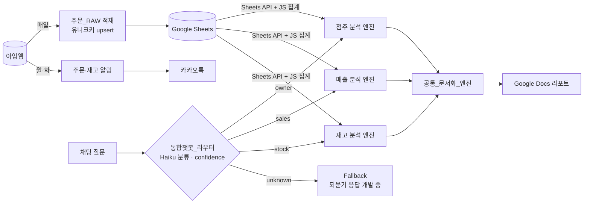

<h1 align="center">Aromaforest Workflow</h1>

향수 프랜차이즈 본사 운영 자동화 · AI 매출 분석 리포트 (n8n) 2026.04~ 실운영 중

<table>
<tr>
<td width="55%" align="center"> ① 채팅으로 분석 요청</td>
<td width="45%" align="center"> ② Google Docs 리포트 자동 생성 (점포명·금액 가림)</td>
</tr>
</table>

리포트 2페이지

## 주요 기능

- 미처리 주문 카카오톡 알림 — 월·화 09:00
- 재고 부족 카카오톡 알림 — 카테고리별 기준, 월·화 09:00
- 카카오 refresh_token 만료 사전 알림 — 만료 3일 전
- 아임웹 주문 데이터 일일 적재 — 상품·옵션 단위, 유니크키 upsert
- AI 매출 분석 리포트 — 채팅 질문 → Google Docs 생성
- 워크플로우 GitHub 백업

## 도입 효과

| 항목 | Before | After |
|---|---|---|
| 주문 확인 | 아임웹 관리자 페이지에서 수동 확인 | 미처리 주문 카톡 수신 |
| 재고 확인 | 상품 목록 수동 조회 | 기준 이하 상품만 카톡 수신 |
| 주문 데이터 | 엑셀 다운로드 → 시트 붙여넣기 → 수식 변환 | 매일 자동 적재 (누적 6천 행 이상) |
| 매출 분석 | 시트 필터·피벗 수동 작업 | 채팅 질문 1회로 Docs 리포트 생성 |

<table>
<tr>
<td width="60%" align="center"> Before — 아임웹 관리자 주문 목록</td>
<td width="40%" align="center"> After — 미처리 주문 카톡 (주문자·금액 가림)</td>
</tr>
</table>

## 아키텍처

| 구분 | 사용 기술 |
|---|---|
| 워크플로우 | n8n (self-hosted) |
| 인프라 | Oracle Cloud ARM · Docker · Caddy (HTTPS 자동 갱신) |
| 데이터 | 아임웹 API v2 · Google Sheets API |
| AI | Anthropic Claude (Haiku 4.5: 질문 분류·파싱 / Sonnet 4.6: 분석) · n8n AI Agent |
| 문서 · 알림 | Google Docs API · Kakao 메시지 API |

## 설계 결정

### AI에는 집계 결과만 전달
- 배경: 주문 시트 원본 약 6천 행 전달 시 입력 토큰 100만 초과 (트러블슈팅 1)
- 결정: Sheets API로 조회 → Code 노드(JS)에서 점주별·월별·상품별 집계 → 집계표만 AI 전달
- 효과: 계산은 코드, 해석은 AI로 역할 분리. 합계 오류 없음, 토큰 사용량 감소

매출 분석 엔진 — Parsing AI → Sheets API → JS 집계 → Report AI → 문서화 엔진

### 질문 분류 라우터
- 배경: 단일 프롬프트에 점주·매출·재고 분석 집중 → 프롬프트 비대, 오답 증가
- 결정: Haiku로 질문 분류, confidence 0.7 미만·미분류 질문은 `unknown`으로 분리해 Fallback 분기로 보냄 (되묻기 응답은 개발 중). 분석은 카테고리별 엔진 담당
- 효과: 엔진별 독립 수정·추가 가능

통합챗봇_라우터 — Switch로 엔진 분기

### 문서 생성 공통 모듈 추출
- 배경: 리포트 워크플로우마다 Docs 생성·스타일 로직 중복
- 결정: 기존 워크플로우 복제·안정화 후 문서 생성부를 `공통_문서화_엔진`으로 추출
- 효과: 동일 JSON 형식(요약·표·상세) 입력 시 동일 형식 리포트 출력

추출 전 원본 — 파싱부터 Docs 스타일 적용까지 단일 워크플로우

### 유니크키 + upsert 적재
- 배경: 같은 기간 재적재 시 매출 중복 집계
- 결정: `주문번호_상품명_옵션값` 복합 키 + `Append or Update`
- 효과: 재실행·백필 시 중복 0건

주문_RAW — A열 유니크키 (주문자 열 가림)

### 인증 로직 서브워크플로우화
- 결정: 아임웹 인증 · 카카오 토큰 갱신을 서브워크플로우로 분리, 주문 알림 · 재고 알림 · 주문 적재가 공통 호출
- 효과: 토큰 교체 시 수정 지점 1곳

## 트러블슈팅

### 1. AI 입력 토큰 100만 초과
- 증상: 매출 분석 요청 실패
- 원인: Google Sheets 도구로 주문 시트 약 6천 행 전체를 Claude에 전달
- 해결: HTTP Request로 Sheets API 직접 호출 → JS 필터링·집계 → 수백 행 수준 집계표만 전달

### 2. 주문 69건 중 1건만 적재
- 증상: 실행 결과 정상(Success)인데 시트에 일부 주문만 존재
- 원인: 가공 노드가 Loop 종료 후 전체 아이템을 한 번에 받는 위치, 코드는 첫 아이템만 처리
- 해결: 입력 전체 순회로 수정, 누락 구간 백필로 전량 복구
- 참고: 아임웹 주문 API는 조회 기간 3개월 초과 시 HTTP 200 + 오류 코드(-19) 반환 → 백필은 3개월 단위 분할 실행

### 3. Google Docs 표 스타일 위치 오류
- 원인: 텍스트·표 삽입 시 문서 index 변동, 최초 계산 위치로 스타일 적용
- 해결: 삽입 → 문서 재조회 → 스타일 적용 3단계 batchUpdate로 분리

### 4. AI 응답 JSON 파싱 실패
- 원인: 모델 응답이 간헐적으로 마크다운 코드블록에 감싸져 반환
- 해결: 코드블록 제거 → JSON 파싱 → 필수 필드 검증 후 다음 노드 전달, 실패 시 해당 단계 중단

## 워크플로우 구성

| 워크플로우 | 역할 · 특징 |
|---|---|
| `아임웹 주문 알림` | 이번 주 주문 중 미완료 건만 필터, 주문자·시간·금액 요약 |
| `재고 부족 알림` | 향료·공병·부자재 카테고리별 기준 + 상품명 키워드(펌프·캡 등) 별도 기준 |
| `카카오 토큰 만료 알림` | 발급일 기준 만료일 계산, 3일 이내 시 알림 |
| `주문_RAW 적재` | 주문 1건 → 상품·옵션 단위 행 분리, 유니크키 upsert |
| `아로마포레스트 AI 챗봇(점주분석 리포트)` | 점주 목록 시트 동적 조회, 최근 6개월 주문 점주만 매칭 |
| `[DEV] 통합챗봇_라우터` | Haiku 분류 + confidence 0.7 기준 `unknown` 분리 |
| `[DEV] AI Response - Sales / Stock` | 카테고리별 분석 엔진 |
| `[DEV] 공통_문서화_엔진` | JSON 입력 → Docs 리포트 생성 |
| `n8n_백업` | n8n API로 워크플로우 export → GitHub private 레포 저장 |
| `아임웹 인증 (서브)` · `카카오 액세스 토큰 갱신 (서브)` | 공통 인증 모듈 |

Import 방법 · placeholder

n8n → Import from File로 JSON 불러오기. 민감값은 placeholder로 치환되어 있으므로 직접 입력 또는 Credential로 이전 필요.

| placeholder | 의미 |
|---|---|
| `YOUR_AROMAFOREST_SHEET_ID`, `YOUR_TOKEN_SHEET_ID`, `YOUR_GOOGLE_FILE_ID` | Google Sheets/Docs 문서 ID |
| `{{KEY}}`, `{{SECRET}}` | 아임웹 API 키 · 시크릿 / Google API 키 |
| `{{CLIENT_ID}}`, `{{CLIENT_SECRET}}`, `{{REFRESH_TOKEN}}`, `{{CODE}}`, `{{KAKAO_ACCESS_TOKEN}}` | 카카오 API |
| `{{X-N8N-API-KEY}}` | n8n API 키 (백업 워크플로우) |
| `your-n8n.example.com` | n8n 서버 도메인 |

- Credential 연결 정보, 실행 데이터(pinData) 제거 상태
- 프롬프트 내 가맹점명·담당자명·매출 수치는 익명 예시 값(`A점`, `가맹점 M`, `담당자1` 등)으로 치환
- `images/` 내 개인정보·금액 가림 처리

